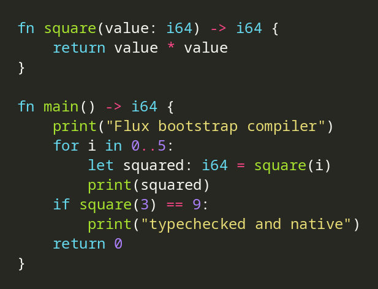
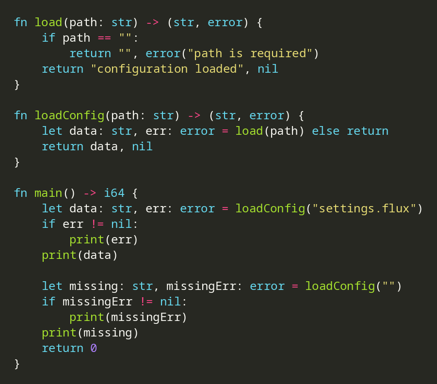

<div align="center">

# Flux

### Python-like syntax. Rust-class performance. Native apps everywhere.

[](https://github.com/brandonp2412/Flux/actions/workflows/performance.yml)
[](LICENSE)

**Flux is a statically typed, ahead-of-time compiled language for building fast, beautiful native software with no classes, no OOP, and no mandatory language runtime.**

</div>

## What Flux does

| | Flux is built for |
| --- | --- |
| 🐍 **Python-like syntax** | Readable, low-ceremony code with indentation-based control flow, comprehensions, slicing, pattern matching, and concise function-first APIs. |
| ⚡ **Rust-class performance** | Native ahead-of-time compilation, no mandatory VM or garbage collector, aggressive optimization, zero-cost abstractions, and continuous comparison against optimized Rust/C baselines. |
| 🌍 **Compile to any platform** | Portable Flux stays portable where useful, while target-specific Flux can call real OS capabilities directly. Backends produce native target code and compiler-owned interop instead of making apps maintain Flutter-style method channels or bridge layers. Linux/GTK is the first rendered bootstrap backend; Android now has a compiler-owned NDK/NativeActivity backend plus native GridLayout/Text/Button/TextInput/Toggle/Radio rendering, state refresh, styling, permissions, notifications, vibration and intents, generating only the minimal runtime Activity/Dex/JNI glue Android framework interfaces require. |
| ✨ **Make beautiful apps** | A flat declarative UI model, native platform controls, grid-first layout, responsive state, typed events, and no giant widget/controller object tree. |
| 🎯 **Dart-inspired language features** | Named/default parameters, collection spreads and `if` elements, comprehensions, exhaustive patterns, first-class functions, functional value updates, and other high-level ergonomics without Dart's class hierarchy. |

Flux is **strictly statically typed**. Implicit coercions are deliberately minimized, unused bindings are compile errors, and there is no warning-only lint tier. Values/functions use lower camelCase, types use PascalCase, and tooling emits canonical Flux style automatically.

The language is designed around data, functions, interfaces, ownership, and explicit control flow. High-level constructs should compile away whenever their semantics do not require runtime work, while required safety checks stay intact.

## What Flux deliberately does not do

| 🚫 | Not in Flux |
| --- | --- |
| **Generics** | No user-facing generic type system. Flux prefers concrete types and compiler-known zero-cost operations. |
| **Any OOP** | Classes do not exist in Flux. No inheritance, mixins, methods, hidden receivers, class constructors, or object-oriented widget trees. Composition is through values, functions, interfaces, and flat views. |
| **`try` / `catch` / `finally`** | Recoverable failures are explicit return values. No exception hierarchy, unwinding model, or invisible error control flow. |
| **Ternaries** | No `condition ? a : b` expression syntax. Use clear control flow or exhaustive value-producing `match` expressions instead. |
| **Heavily nested layout** | UI is flat and grid-first. Sibling elements declare placement directly instead of building deeply nested layout/widget trees. |

## Language shape

- Function bodies use `{}` while `if`, `for`, `while`, and `match` bodies use indentation.
- Ownership and borrowing aim for Rust-class memory safety without requiring Rust-style source syntax everywhere.
- Interfaces are explicit typed capability contracts, not objects or classes. Flux has no class type or class system.
- Tooling is part of the product: formatter, LSP, debugger, profiler, testing, packaging, and performance validation are first-class language work.

<details>
<summary><strong>Current bootstrap compiler capabilities</strong></summary>

The repository currently contains a dependency-free Rust bootstrap compiler with:

- parsing for functions, structs, closed payload enums, typed bindings, calls, field access, `if` / `elif` / `else`, exclusive `start..end` and inclusive `start..=end` integer range `for` loops, indentation-based `while` loops, statically scoped `break` / `continue`, and bootstrap `app ViewName` GUI entry declarations;
- immutable `let` bindings by default plus explicit typed local mutation through `var` and statically checked assignment;
- explicit multi-value function returns and strictly typed destructuring bindings;
- static checking for `i64`, `bool`, `str`, `error`, `void`, named struct value types, transparent concrete type aliases, and compile-time constants, with ordinary escaped, `r"..."` raw, and triple-quoted multiline string literals sharing the same `str` representation;
- struct literals, field access, `Type { ..base, field: value }` functional updates, and struct destructuring patterns with inferred field types and single-evaluation native lowering;
- namespace-qualified enum construction such as `Outcome.Ok(42)`, with typed payload validation and native tag/union representation;
- exhaustive enum `match` statements with typed payload bindings, guaranteed-return analysis, and single-evaluation native `switch` lowering;
- positional and named-only function parameters with required named arguments, compile-time defaults, and zero-runtime-overhead call reordering;
- first-class named and capture-free anonymous function values plus concrete `fn(...) -> ...` function types, lowered to typed native function pointers without callable objects; outer-local captures remain rejected until ownership-safe closure semantics exist;
- shell-inspired typed call flow: parentheses-free positional calls, `|` value pipelines, scalar-result `>`/`>>` file redirection, and trailing `&` detached execution without turning functions into untyped subprocess commands;
- concrete no-generics list syntax with homogeneous `T[]` literals, exact/rest inferred `let [first, _, last] = list` / `let [first, ...middle, last] = list` destructuring patterns, exhaustive direct list `match` with exact/rest/wildcard arms, `...source` spread elements, list-only `if condition: value` / `if condition: first else: second` construction items, checked positive/negative indexing, full Python-style zero-copy slicing including steps and `[::-1]` reversal through native strided views, filtered list comprehensions, zero-cost `length` / `isEmpty` / `isNotEmpty` properties, checked `first` / `last` / `single` access, `any` / `every` boolean aggregation, typed `map` / `filter` / `where` transforms, typed `fold` / `reduce` scalar reductions, typed `concat`, stable scalar `distinct`, one-level nested-list `flatten`, immutable scalar `sorted`, zero-copy `chunked`, compiler-fused transform pipelines that avoid intermediate list buffers, typed `for value in list:` / `for index, value in list:` iteration, and zero-copy `take` / `skip` views that compose through typed pipelines; the bootstrap currently keeps list values immutable/local until ownership-safe escaping storage is implemented;
- function signature, return, and argument validation;
- structured parse/type/codegen diagnostics with stable source IDs, reusable source-span metadata, and safe multi-error parser/type-checker recovery;
- terminal diagnostics that show the offending source, exact carets, related declaration labels and suggested fixes, automatically colorize interactive terminals, and wrap/crop to the current terminal width;
- parser recovery that reports syntax errors from later malformed functions instead of stopping at the first one;
- target-aware native bootstrap code generation: Linux applications lower to GTK4, while Android application builds lower to an NDK `NativeActivity` shared library with compiler-owned lifecycle entry points and native GridLayout/Text/Button/TextInput/Toggle/Radio rendering, state refresh, core styling, IME callbacks and accessibility descriptions; application code remains Java/Kotlin/JNI-free, with the compiler generating the minimal runtime Activity/Dex/JNI glue required by Android framework interfaces rather than exposing a method-channel bridge;
- checked `i64` arithmetic at runtime: addition, subtraction, multiplication, negation, and division fail explicitly on overflow or invalid division instead of relying on C signed-overflow behavior;
- CLI commands for checking, deterministic formatting, emitting C, building native executables, automatically running/rebuilding development targets, and serving bootstrap LSP diagnostics over stdio, including package-root/`flux.toml` targets;
- primitive constant folding for `i64`, `bool`, and `str`: top-level constants support forward references with no runtime global storage, while pure literal/constant subexpressions in ordinary code and static UI/application metadata collapse before native emission with checked arithmetic and boolean short-circuiting preserved;
- the first ownership slice: one alias-aware structural `Copy` classification shared by semantic validation, direct local transfers that move non-copy values with use-after-move rejection, and a semantic-CFG fixed-point move analysis with deterministic move origins, branch/loop reachability, and compile-time impossible-edge pruning, plus non-consuming immutable list/view reads and parameters; borrow regions, partial moves, drops, lifetimes, consuming calls/returns, and field ownership remain pending;
- whole-program tree shaking and interface specialization driven increasingly by typed IR: native lowering prunes unreachable private functions, value types, helpers, unused interface implementations/targets, and redundant single-target interface dispatch while preserving public/open boundaries conservatively;
- compiler tests and runnable native examples, including typed shell-style call flow, local immutable lists/indexing/slicing/comprehensions, nested structs, struct destructuring, zero-cost type aliases, folded constants, payload enums, exhaustive matching, named/default parameters, named/capture-free anonymous higher-order functions, explicit mutation/`while`, flat-grid UI syntax, typed built-in UI properties, parameterized view composition, and native GTK4/Wayland Text/Button/TextInput/Image/Toggle/Radio controls with typed callback dispatch, live text-change/submit callbacks, hover/leave/focus events, button keyboard shortcuts, autofocus, password masking, maximum input length, file-backed images, tooltips, accessible labels/descriptions, Pango-backed family/slant/decoration/spacing typography, static or state-driven transforms, and read-only window/orientation/display-scale bindings for responsive property expressions.

</details>

The C backend is a bootstrap implementation, not the final backend architecture. The intended next backend milestone is a direct typed IR suitable for LLVM-class optimization and target-specific lowering. Flux's performance target is safe Rust-class native code: the compiler should not preserve abstraction overhead that can be proven unnecessary, while retaining required safety semantics when they cannot be optimized away.

## Create a project

Scaffold and run a minimal native GUI package:

```sh
./tools/flux new my-flux-app
./tools/flux run my-flux-app
```

`flux run` compiles and launches the package with automatic save-triggered rebuilds. `flux new` also creates `tests/smoke.flux`, so the package can immediately exercise the bootstrap integration-test runner with `./tools/flux test my-flux-app`. `flux new` refuses to overwrite a non-empty directory. `./tools/flux` is a repo-local bootstrap launcher; after `cargo build`, the same CLI is available directly as `target/debug/flux`. The compatibility binary `fluxc` remains during bootstrap development.

Create the first host-native distribution bundle with `./tools/flux package my-flux-app`. By default it writes `dist/<name>-<version>-<os>-<arch>/` containing the package-named native executable and the exact `flux.toml`; `-o <directory>` chooses another destination and `--mode` selects debug/profile/release. Existing bundle directories are not overwritten. This is intentionally a bootstrap host bundle, not yet a self-contained distro/store package: GTK and other native runtime dependencies remain host responsibilities.

Native Clang outputs are content-addressed and reused across `flux build`, `flux run`, `flux test`, and `flux package` when the generated C, build mode, Flux compiler version, and host target are unchanged. The cache uses `$FLUX_CACHE_DIR/native` when configured, then the XDG cache directory or `~/.cache/flux/native`; this is a bootstrap artifact cache, not yet incremental semantic/codegen compilation or a managed remote cache. Generated C is streamed directly to Clang rather than compiled from PID-named temporary files, so identical debug/profile/release builds are byte-reproducible on the same host/toolchain; cross-machine reproducibility still requires pinned toolchain/runtime/dependency identities.

## Example



[View the copyable source](examples/hello.flux)

Build it:

```sh
./tools/flux build examples/hello.flux -o hello
./hello
```

Build modes are explicit and predictable: `flux build` defaults to `release`, while `--mode debug`, `--mode profile`, and `--mode release` select no-optimization/full-debug, optimized-with-debug/frame-pointers, and aggressive optimization/LTO profiles respectively. `flux run` defaults to `debug` for development but accepts the same `--mode` override. Debug/profile builds preserve Flux source paths and statement lines through generated C `#line` metadata, so native DWARF line tables point back to the original `.flux` files rather than stdin-generated C.

Optimized native performance is continuously compared with overflow-safe C and Rust baselines. `./tools/flux-bench` builds the compiler and the compute, collection-pipeline, and interface-dispatch workloads in `benchmarks/perf`, validates identical output, reports median runtime plus binary size against both baselines, and fails when Flux exceeds the configured checked-Rust ratio (1.25× by default; override with `--max-ratio` or `FLUX_PERF_MAX_RATIO`). Each timing round averages three executions by default before the cross-round median is taken, reducing scheduler/process jitter without choosing a best-case sample; `--batch` controls that averaging. C remains reported as the lower-level optimization reference. The same 7-round × 3-execution gate runs on pushes to `main` and pull requests.

```sh
./tools/flux-bench --runs 7 --batch 3
./tools/flux-bench --runs 7 --batch 3 --json
```

Run in development mode with automatic save detection:

```sh
./tools/flux run examples/hello.flux
```

The first native GUI dogfood example uses `app HelloApp(...)` instead of `fn main` and lowers its existing flat `view` grid to GTK4 native controls on Linux. Bootstrap application metadata may set a compile-time `title: str`, `width: i64`, and `height: i64`; dimensions must be positive and may reference compile-time constants:

```sh
./tools/flux build examples/hello_app.flux -o hello-app --mode debug
./hello-app
```

`examples/hello_app.flux` opens a real native window containing `Text` and `Button` plus explicit view-local state. Its button uses the functional transition `onPress: clicked => !clicked`; the compiler type-checks that next-state expression and the Linux runtime refreshes the state-derived native label/button properties without rebuilding the window/grid. `examples/counter_app.flux` extends the same model to `i64` state and named read-only `derived` values such as `derived positive: bool = count > 0`; derived values may depend on state, window environment bindings, constants, parameters, and earlier derived values, and are recomputed before dependent native properties refresh. Bootstrap mutable UI state intentionally remains limited to safe scalar `bool`/`i64` values until owned strings and aggregate ownership semantics exist. GTK4 is a bootstrap Linux platform backend, not a source-language widget model: Flux code remains flat/function-first and does not import or construct GTK objects. The backend uses GTK's native Wayland integration when launched on Wayland.

The bootstrap runner watches imported Flux modules automatically, debounces rapid saves, recompiles on change, and restarts only after a successful replacement build. Compiler errors keep the last good process untouched and the watcher remains active until the next save. State-preserving hot apply is a later development-ABI milestone; the current runner is the controlled-restart foundation for it.

Run native Flux integration tests. A package target discovers sorted `tests/*.flux` programs; a direct `.flux` target runs that one test. Each test is an ordinary headless `fn main() -> i64` program and passes only when its native process exits successfully:

```sh
./tools/flux test examples/package
./tools/flux test examples/hello.flux
```

Check or explicitly analyze without producing a binary:

```sh
./tools/flux check examples/hello.flux
./tools/flux analyze examples/hello.flux
```

Inspect the currently runnable Flux target, verify native GUI prerequisites, and clean generated target artifacts when needed:

```sh
./tools/flux devices
./tools/flux doctor
./tools/flux clean examples/package
```

`flux devices` reports the honest bootstrap device surface: Linux desktop plus whether the active Wayland/X11 session is launch-ready, Android devices visible through ADB including offline/unauthorized state, and a running local Waydroid container. `flux doctor` reports Linux prerequisites, Android SDK/NDK/build-tools/ADB, and Waydroid readiness. `flux run android` selects a runtime whose ABI matches the built APK: a matching ADB device is preferred, otherwise a matching running Waydroid container is used, and known ABI mismatches fail before installation. When `--abi` is omitted Flux probes the available runtime ABI before building. `flux clean` removes the target's default native binary and last-known development-run status and is safe to run repeatedly.

Human diagnostics use the terminal width (`COLUMNS` when supplied, otherwise the interactive terminal width) and enable ANSI color only for an appropriate terminal. `NO_COLOR` disables color; `FORCE_COLOR=1` can force it. Long source lines and paths are cropped around the relevant span instead of overflowing, while diagnostic messages, labels, notes, and fixes wrap to fit.

Format source deterministically, or verify canonical formatting in CI:

```sh
./tools/flux format examples/hello.flux
./tools/flux format examples/hello.flux --check
```

Editors can launch the bootstrap language server directly over stdio:

```sh
./tools/flux lsp
```

The current LSP slice publishes parse/type diagnostics using the same source spans, labels, and fix metadata as the compiler, including real import-graph type checking with every open unsaved Flux buffer substituted as an in-memory project overlay. It also serves canonical whole-document formatting, machine-applicable quick fixes, safe declaration/unambiguous-symbol hover and go-to-definition, dependency-graph references/rename, typed signature help for every current parenthesized call form (ordinary/imported functions, first-class function values, interface capabilities, enum payload constructors, interface packing, and compiler built-ins), full-document semantic highlighting, focused inferred-type inlay hints, and completion for keywords/builtins/current-module plus public forward-import declarations and lexically visible local bindings. Qualified completion for enum/interface namespaces works during incomplete edits such as `Outcome.` and `Storage.`, including reachable imported declarations; struct member completion also survives incomplete edits for explicitly typed parameters/`let`/`var` values, transparent aliases, nested field paths such as `user.profile.`, and named single-return function results such as `loadUser().`. Flat `view` blocks receive contextual completion and hover from the compiler's own UI contracts: grid declarations, built-in element kinds, typed element properties, and composed-view parameters; same-file custom-view property completion keeps earlier contracts available while the currently edited view is malformed, and built-in UI hover remains available during incomplete edits. Inlay hints are intentionally limited to types Flux actually infers, such as pattern and range-loop bindings, rather than repeating explicit annotations. Imported ordinary-function completion, hover, and signature help use unsaved overlays as well. Ambiguous/shadowed navigation and rename are deliberately refused rather than guessed. Reverse-dependent discovery, fully resolved shadow-aware usage navigation, more complex recovered-expression member completion, and richer UI navigation remain later LSP milestones.

Tooling/CI can request structured diagnostics without parsing human text:

```sh
./tools/flux check examples/hello.flux --json
```

Packages can select their entry source with `flux.toml`:

```toml
[package]
name = "package-example"
version = "0.1.0"
entry = "src/main.flux"

[android]
application_id = "nz.example.package"
version_code = 42
min_sdk = 23
target_sdk = 36
permissions = ["android.permission.CAMERA", "android.permission.RECORD_AUDIO"]
keystore = "signing/release.jks"
key_alias = "release"
```

The `[android]` table is optional. When omitted, Flux derives a safe `app.flux.<package>` application ID and currently defaults to `version_code = 1`, minSdk 23, and targetSdk 36. `version_code` must be a positive Google Play-compatible value no greater than 2100000000 and should increase for every published release. `permissions` is an optional array of Android permission names; Flux validates and de-duplicates it before generating `<uses-permission>` entries. `keystore` and `key_alias` are optional but must be configured together; a relative keystore path is resolved from the package root. Release-signing passwords are never stored in `flux.toml`: set `FLUX_ANDROID_KEYSTORE_PASSWORD`, and optionally `FLUX_ANDROID_KEY_PASSWORD` when the private-key password differs. Without release signing configuration Flux uses its compiler-managed development key. Android builds require an `app` root, the installed Android SDK/NDK/build-tools (including D8), and `javac` for the compiler-generated runtime Activity class; application projects still contain no Java/Kotlin/JNI bridge code. `examples/android_app` is a checked-in package for this path:

```sh
./tools/flux build android examples/android_app --mode debug --abi arm64-v8a
./tools/flux build android examples/android_app --mode release --abi x86_64
./tools/flux build android examples/android_app --mode release --format aab
./tools/flux run android examples/android_app --abi arm64-v8a
```

APK builds emit one aligned, signed artifact containing `lib/<abi>/libflux.so`, compiler-generated `classes.dex`, and a generated launcher manifest. AAB builds compile all supported ABIs into one signed App Bundle with `base/dex/classes.dex` plus each native ABI and use bundletool to validate the Play publishing structure. Development signing is compiler-managed; configured release APKs/AABs use the package keystore and environment-supplied credentials, suitable for an upload key used with Play App Signing. Android rendering maps Flux's flat grid to native `GridLayout`, `TextView`, `Button`, `EditText`, `CheckBox`, and `RadioButton` controls. Bool/i64 view state, derived values, dynamic text/visibility/enabled expressions, direct button/toggle/radio callbacks, live text-change/IME-submit callbacks, fractional/fixed grid sizing, gaps/margins, minimum sizes, alignment, core backgrounds/borders/radius/padding/text styling, tooltips, and accessibility descriptions all lower through compiler-owned native/framework code. `Image`, richer/dynamic styling, shadows/transforms, and deeper input/semantics work remain on the roadmap.

Android-specific platform functionality is exposed directly as compiler-owned Flux APIs rather than method channels or application-written JNI. `android.sdk_int()` reads the device API level directly through the NDK, so target-specific Flux can use ordinary typed comparisons for runtime availability gates. `android.vibrate(duration_ms)` lowers to Android's vibrator service and automatically adds `android.permission.VIBRATE` only when reachable. General runtime permissions use `android.permission_granted(permission)` and `android.request_permission(permission)` alongside declarative `[android].permissions`. `android.open_url(url)` emits an `ACTION_VIEW` intent, while `android.share(text)` opens the native `ACTION_SEND` chooser. Notifications are also direct Flux calls: create channels with `android.create_notification_channel(...)`, query/request the Android 13+ notification permission, post with `android.notify(...)`, attach a native URL `PendingIntent` action with `android.notify_url_action(...)`, and remove one with `android.cancel_notification(id)`. Flux adds `android.permission.POST_NOTIFICATIONS` only when reachable notification code needs it. Android lifecycle metadata maps directly to the compiler-owned `NativeActivity` boundary: ordinary no-argument callbacks cover start/resume/pause/stop/exit plus configuration and low-memory events, while `on_save_state: fn() -> str` and `on_restore_state: fn(str) -> void` serialize a small app-defined state payload through Android's saved-instance-state buffer. Framework-bound calls and native View listeners use generated JNI/UTF-8/runtime-Activity glue hidden behind the compiler; all current Android APIs are statically typed, appear in LSP completion/signature help, and reachable Android calls are rejected when building for a non-Android target while unreachable platform-only code can still be tree-shaken from another target.

The package directory or manifest can then be passed directly to project-aware commands:

```sh
./tools/flux check examples/package
./tools/flux build examples/package -o package-example
```

## Explicit errors and multi-value returns

Flux keeps multi-values explicit rather than turning general tuples into ordinary values. Functions can return several statically typed values, callers destructure them explicitly, and an exact multi-value result can be forwarded directly when the enclosing function has the same return shape.

Recoverable failures use the built-in `error` type: `nil` means no error and `error("message")` creates a recoverable failure. `error` is compiler-known rather than a generic result wrapper, and Flux does not use exceptions or stack unwinding for normal failures.

`else return` is a narrow propagation form for a destructuring call whose final value is `error`. The call is evaluated once; a non-`nil` error returns the exact result immediately, otherwise execution continues with the successful values. Arity and every return type are checked statically.



[View the copyable source](examples/errors.flux)

## Roadmap

`ROADMAP.MD` is the source of truth for Flux development and is updated at the start of every development session. It covers the complete language/compiler plan, Dart-inspired non-OOP ergonomics, ownership, native UI, Android/iOS/desktop/web/server targets, automatic save-triggered hot reload, testing, LSP, debugger, profiler, packaging, and Flux 1.0 criteria.

See `ROADMAP.MD` for planned work and `docs/language.md` for the evolving language specification.
