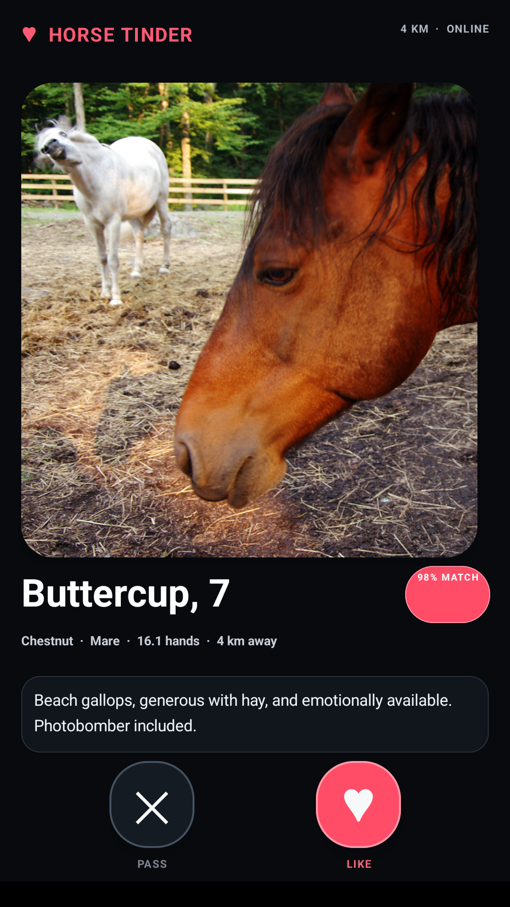

<div align="center">


### Python-like syntax. Rust-class performance. Native apps everywhere.

[](https://github.com/brandonp2412/Flux/actions/workflows/performance.yml)
[](LICENSE)

**Flux is a statically typed, ahead-of-time compiled language for native software without classes, a VM, or a mandatory framework runtime.**

</div>

## Why Flux

Flux combines readable function-first syntax, Rust-class safety/performance goals, direct native platform access, and a flat declarative UI model.

- Python-like control flow, comprehensions, slicing, patterns, and low ceremony.
- Strict static typing; unused bindings are compile errors.
- No classes, inheritance, mixins, source generics, exceptions, or ternaries.
- Values, functions, interfaces/capabilities, ownership, and explicit errors instead of OOP.
- Native AOT output with compiler-owned platform interop instead of app-written bridge code.
- Flat grid-first UI that targets native controls and is designed to look beautiful by default.
- Formatter, LSP, tests, diagnostics, hot-reload work, and performance gates are part of the language product.

## Current status

Flux is an active Rust bootstrap compiler. It already supports substantial typed language semantics, modules/packages, exhaustive matching, first-class functions, typed collections/pipelines, semantic CFG and typed-IR foundations, tree shaking/interface specialization, a native GTK4 Linux GUI backend, and compiler-owned Android APK/AAB generation.

Ownership/borrowing, owned strings/collections, broader platform coverage, production hot reload, the full beautiful-by-default UI system, and the long-term optimizing native backend remain roadmap work.

## Quick start

```sh
flux new my-flux-app
flux run my-flux-app
```

```sh
flux build examples/hello.flux -o hello
flux test examples/package
flux check examples/hello.flux
flux format examples/hello.flux
flux debug examples/branches.flux --break examples/branches.flux:3
flux profile benchmarks/perf/compute.flux
flux lsp
```

Android:

```sh
flux build android examples/android_app --mode debug --abi arm64-v8a
flux run android examples/android_app --device waydroid
flux build android examples/android_app --mode release --format aab
flux publish android my-app --json
```

## Built with Flux

<div align="center">



<sub>Real Android screenshot from the checked-in <code>examples/mobile_showcase</code> Flux app, compiled by Flux and captured from Waydroid. Reproduce it with <code>./tools/capture-readme-showcase</code>.</sub>

</div>

The classic compiler example and highlighted source are in [`examples/hello.flux`](examples/hello.flux). The native GUI dogfood path is documented in [`docs/manual-e2e.md`](docs/manual-e2e.md), source debugging in [`docs/debugging.md`](docs/debugging.md), CPU profiling in [`docs/profiling.md`](docs/profiling.md), and Google Play upload-bundle publishing in [`docs/android-release.md`](docs/android-release.md).

## Development

[`ROADMAP.MD`](ROADMAP.MD) is the single source of truth for both implementation work and persistent overall progress. [`docs/language.md`](docs/language.md) is the evolving language reference, and [`benchmarks/perf`](benchmarks/perf) contains the optimized Flux/Rust/C comparison workloads.

Flux is under active development and is not yet a stable 1.0 language.
